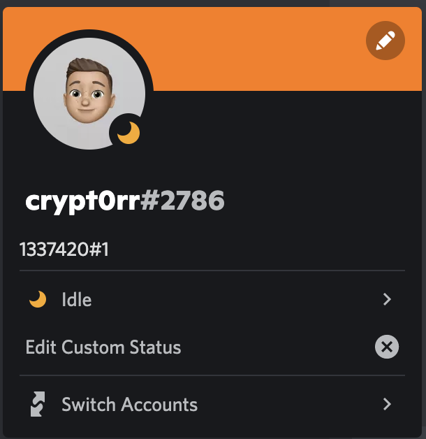

# Challenge 3 - Answers

*"If you know, you know!" do you?*

John has done some CTF in the past. Maybe you've heard from this [Steganography](https://en.wikipedia.org/wiki/Steganography) technique to? Hiding something in another object. Exactly this is what happened here. The first file that is needed for this challenge is the picture, hiding a `.ZIP` file. Can you spot it?

You can extract the `.ZIP` file from the image in multiple ways for example with [Binwalk](https://github.com/ReFirmLabs/binwalk).

If we take a look at the file with Binwalk we can spot the archive hiding inside. Not getting the same results? Try an other way of saving the file, for instance just clone the repo.

```plain
$ binwalk aipdr.png               

DECIMAL       HEXADECIMAL     DESCRIPTION
--------------------------------------------------------------------------------
0             0x0             PNG image, 2606 x 1424, 8-bit/color RGBA, non-interlaced
3233          0xCA1           TIFF image data, big-endian, offset of first image directory: 8
316730        0x4D53A         Zip archive data, encrypted at least v2.0 to extract, compressed size: 136577, uncompressed size: 136565, name: archive2.zip
453349        0x6EAE5         Zip archive data, encrypted at least v2.0 to extract, compressed size: 19, uncompressed size: 7, name: flag_1
453586        0x6EBD2         End of Zip archive, footer length: 22
```

To extract we only have to add the `--extract` option and Binwalk does the rest.

```plain
$ binwalk --extract aipdr.png    

DECIMAL       HEXADECIMAL     DESCRIPTION
--------------------------------------------------------------------------------
0             0x0             PNG image, 2606 x 1424, 8-bit/color RGBA, non-interlaced
3233          0xCA1           TIFF image data, big-endian, offset of first image directory: 8
316730        0x4D53A         Zip archive data, encrypted at least v2.0 to extract, compressed size: 136577, uncompressed size: 136565, name: archive2.zip
453349        0x6EAE5         Zip archive data, encrypted at least v2.0 to extract, compressed size: 19, uncompressed size: 7, name: flag_1
453586        0x6EBD2         End of Zip archive, footer length: 22

/_aipdr.png.extracted 
$ ls
4D53A.zip    archive2.zip flag_1
```

Of course the first password is `Sensecon`! Next up some countries where SensePost operates in and to get back to the picture the five pillars are used to.

After that it becomes more a cracking thing and some scripting, the first password was given in the Discord Channel in my user profile (only once a for four hours), can you spot it?



The other way is to crack your way in, the password can be cracked quite easily.

## Passwords file

This file is used to encrypt the `.ZIP` files into each other. The first line is the password that is used on the last `.ZIP` file with the final flag. So start from the bottom when extracting.

* [passwords](passwords)

## Flags file

The flags that can be found in each zip file in the order of extracting.

* [flags](flags)
